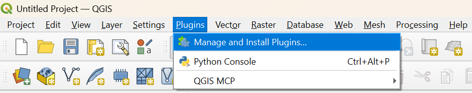
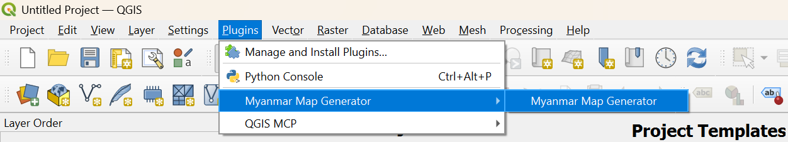

# Myanmar Map Generator - QGIS Plugin

A QGIS plugin for generating thematic maps of Myanmar townships from Excel data.

## Features

- **Multi-color mode**: Each category gets a different color
- **Single color mode**: Binary display (data vs no-data)
- **Custom color picker**: Choose your own colors
- **Label settings**: Toggle labels, adjust size
- **Export options**: PNG and PDF with customizable DPI
- **Page sizes**: A4 and A3 support
- **Auto column detection**: Automatically reads Excel columns

## Screenshots

## Installation

### Option 1: Manual Installation

1. Download or clone this repository
2. Copy the `myanmar_map_plugin` folder to your QGIS plugins directory:
   - **Windows**: `%APPDATA%\QGIS\QGIS3\profiles\default\python\plugins\`
   - **Linux**: `~/.local/share/QGIS/QGIS3/profiles/default/python/plugins/`
   - **Mac**: `~/Library/Application Support/QGIS/QGIS3/profiles/default/python/plugins/`
3. Restart QGIS
4. Enable the plugin: **Plugins** → **Manage and Install Plugins** → Search "Myanmar Map Generator"

### Option 2: Install from ZIP

1. Download the repository as ZIP
2. In QGIS: **Plugins** → **Manage and Install Plugins** → **Install from ZIP**
3. Select the downloaded ZIP file

## Usage

1. Click the **Myanmar Map Generator** button in the toolbar
2. **Select data files**:
   - State shapefile (boundaries)
   - Township shapefile
   - Excel data file
3. **Map the columns**:
   - P_Code fields for joining data
   - Category column for colors
   - Township and Label columns
4. **Choose color mode**:
   - Multi-color: each category gets a different color
   - Single color: data vs no-data display
5. **Configure map settings**:
   - Map title
   - Labels on/off and size
   - Page size (A4/A3)
   - Export DPI
6. Click **Preview Map** to see in QGIS canvas
7. Click **Generate & Export** to export PNG/PDF

## Data Requirements

### Shapefile
- Township shapefile with P_Code field (e.g., `TS_PCODE`)
- State/Region boundary shapefile

### Excel File
- P_Code column matching shapefile
- Category column for thematic mapping
- Township name column (optional, for labels)
- Additional data columns as needed

## Example Data Structure

| TS_Pcode | Township | Thematic25 | IP_25 |
|----------|----------|------------|-------|
| MMR001001 | Myitkyina | Category A | IP1 |
| MMR001002 | Waingmaw | Category B | IP2 |

## Requirements

- QGIS 3.x
- pandas (usually included with QGIS)

## License

This project is licensed under the GPL-3.0 License - see the [LICENSE](LICENSE) file for details.

## Contributing

1. Fork the repository
2. Create your feature branch (`git checkout -b feature/AmazingFeature`)
3. Commit your changes (`git commit -m 'Add some AmazingFeature'`)
4. Push to the branch (`git push origin feature/AmazingFeature`)
5. Open a Pull Request

## Author

- **PS_GIS**

## Acknowledgments

- QGIS Development Team
- Myanmar Information Management Unit (MIMU) for shapefiles
